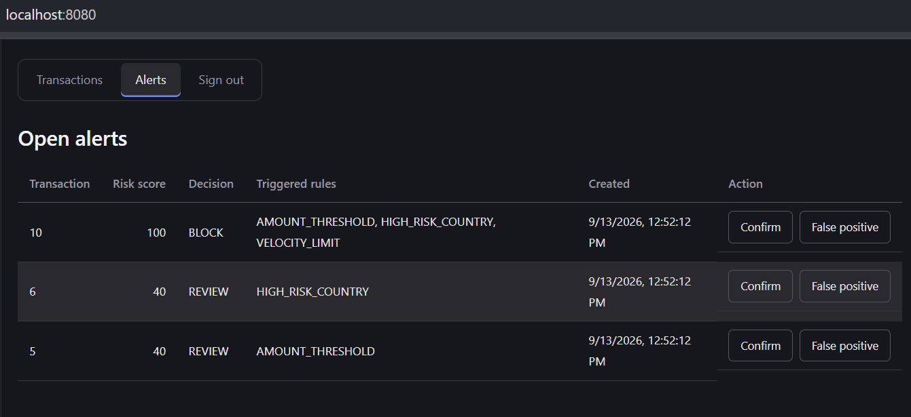
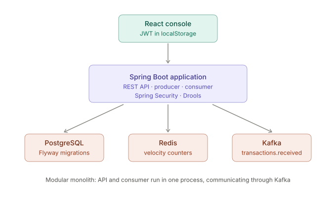

# Fraud Detection Platform

A bank transaction fraud detection service: transactions are ingested through a
REST API, scored asynchronously against a rule engine and a Redis-backed
velocity check, and routed to approve, review or block. Analysts resolve the
resulting alerts in a small React console.

Built as a portfolio project to practise event-driven design, not as a
production system. Known limitations are listed at the end.

## What it does

A transaction arrives at `POST /api/v1/transactions`. The API validates it,
rejects duplicates, saves it, publishes it to Kafka and returns `202 Accepted` —
the caller does not wait for scoring.

A consumer picks the event up, counts recent transactions for that account in
Redis, evaluates three rules, and sums their weights into a risk score clamped
to 0–100. The score maps to a decision: **APPROVE** below 40, **REVIEW** for
40–79, **BLOCK** at 80 or above. Anything above APPROVE raises an alert for a
human to resolve.

The three rules are single-transaction amount above a threshold, a destination
country on a high-risk list, and more transactions in the time window than the
configured limit. Each contributes an equal weight, because no historical fraud
data exists here to justify ranking one signal above another.

## Architecture

The API, the Kafka producer and the consumer run in a single process — a
modular monolith rather than separate services. Packages are split by feature
(`alert`, `auth`, `rules`, `transaction`, `velocity`), so a service boundary
could be drawn later without rearranging the code.

## Tech stack

| Layer | Choice |
| --- | --- |
| Language, runtime | Java 21, Spring Boot 3.5 |
| Persistence | PostgreSQL 18, Flyway migrations, Spring Data JPA |
| Messaging | Apache Kafka 4.1 (KRaft) |
| Cache, counters | Redis 8 |
| Rules | Drools 10, behind a strategy interface |
| Security | Spring Security, JWT (jjwt) |
| Observability | Micrometer, Prometheus endpoint |
| Testing | JUnit 5, Mockito, Testcontainers, JaCoCo |
| Frontend | React, TypeScript, Vite, axios |
| Packaging | Docker multi-stage build, Docker Compose |

## Design decisions

**Scoring runs through Kafka rather than inside the request.**
Submitting a transaction and assessing its risk are separate concerns. Decoupling
them buys three things: the API absorbs traffic spikes without the rule engine
becoming the bottleneck, a failure in scoring does not fail the submission, and
the consumer could scale independently of the API.

The cost is eventual consistency — a transaction is briefly visible with no
score. That is acceptable here because this is a post-hoc detection and review
system, not a card authorisation gateway. A three-band decision that includes
"send to a human" only makes sense when a short delay is tolerable.

**Kafka messages are keyed by account id.**
Kafka guarantees ordering within a partition, and the same key always routes to
the same partition. Keying by account means one account's transactions are never
processed concurrently.

This is load-bearing, not cosmetic: the velocity rule reads and increments a
per-account counter in Redis. Without the ordering guarantee, four transactions
on one account could be handled by different threads at once, each reading a
stale count, and the velocity rule would silently never fire.

**The rule engine sits behind an interface.**
`RuleEvaluator` has two implementations — a plain Java one and a Drools one —
selected by a single configuration property. Both stay on the classpath; only
one bean is created.

This exists to make the comparison possible: the Drools version demonstrates
externalising rules into DRL, the simple version shows what that abstraction
actually costs. The trade-off is a layer of indirection that a project with one
fixed rule set would not need.

**The JWT is stored in localStorage, and CSRF protection is disabled.**
These two decisions are one decision. CSRF attacks work because browsers attach
cookies to cross-site requests automatically. A token in localStorage is only
sent by code that deliberately reads it, so the attack does not apply and the
CSRF filter has nothing to protect.

The cost is real: anything that can run JavaScript on the page can read the
token. The stronger alternative is an httpOnly cookie plus a CSRF token, which
this project does not implement. The token is short-lived (one hour) because a
JWT cannot be revoked — expiry is the only exit.

## Running it

Requires Docker and Docker Compose.

cp .env.example .env # then set the three values
docker compose up -d

The console is at `http://localhost:8080`. Sign in with the analyst account
created from `SEED_ANALYST_PASSWORD`.

`.env` holds the JWT signing key and the two seed passwords. It is gitignored;
`.env.example` documents what is needed. A missing `JWT_SECRET` fails startup
deliberately — falling back to a default would mean every clone of this
repository shared one signing key. Missing seed passwords only log a warning,
because the application still works, nobody can log in yet.

To generate demo data covering all three decisions:

.\seed-demo.ps1

## Testing

118 tests, 82% line coverage, enforced by a JaCoCo check at 75%.

Integration tests run real PostgreSQL, Kafka and Redis through Testcontainers
rather than mocks, so the JPA mappings, Flyway migrations and Kafka wiring are
exercised against the actual services.

mvn verify

The image build skips tests on purpose: Testcontainers needs a Docker daemon
that the build stage cannot reach. Verification belongs in CI, before the image
is built.

## Known limitations

- Rules are fixed in configuration and code; there is no UI to author them.
- Alerts have no assignment or audit trail beyond a resolved timestamp.
- The JWT filter has no unit test of its own; its behaviour is covered
  indirectly through the controller slice tests.
- Kafka runs without a persistent volume, so topics and offsets are lost on
  restart. Fine locally, wrong for anything real.
- Single Kafka partition leader and single broker; no replication.
